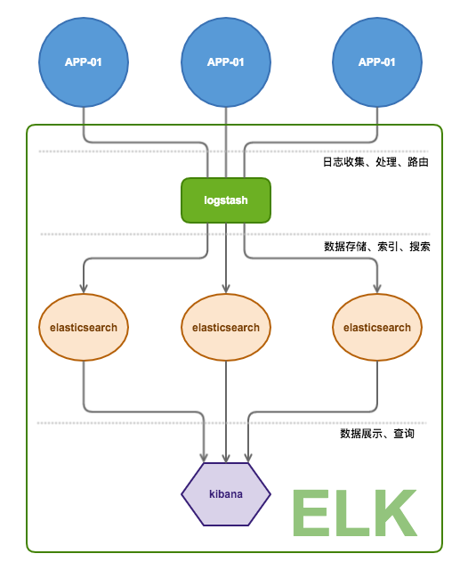

# dockerfile for logstash 2.1

> Logstash 是一款用来收集、处理和转发事件和日志消息的工具。它可以通过配置文件与众多的插件关联，包括未经处理的 socket/packet 通讯，文件tailing和各类消息总线客户端。一旦输入插件收集到了日志以后，就可以通过大量的过滤器修改或者注释事件数据。最终事件会路由到输出插件，可以对接外部的程序中，包括Elasticsearch、本地文件和各类消息总线中间件。
> 更详细的信息参见: [ 官方wiki ](https://wikitech.wikimedia.org/wiki/Logstash)


<a href="http://app.goodrain.com/app/18/" target="_blank" ></img></a>


# 目录
- [部署到好雨云](#部署到好雨云)
  - [ELK 结构](#ELK（elasticsearch+logstash+kibana）结构)
  - [一键部署](#一键部署)
  - [与应用关联](#与应用关联)
  - [编写应用日志匹配规则](#编写应用日志匹配规则)
- [部署到本地](#部署到本地)
  - [拉取或构建镜像](#拉取或构建镜像)
      - [拉取镜像](#拉取镜像)
      - [构建镜像](#构建镜像)
  - [利用命令行配置启动 Logstash](#利用命令行配置启动 Logstash)
  - [利用配置文件启动 Logstash ](#利用配置文件启动 Logstash )
- [项目参与和讨论](#项目参与和讨论)

# 部署到好雨云

## ELK（elasticsearch+logstash+kibana）结构


## 一键部署
通过点击本文最上方的 “安装到好雨云” 按钮会跳转到 好雨应用市场的应用首页中，可以通过一键部署按钮安装

**注意：**

- `logstash` 应用依赖 `elasticsearch` 和 `kibana` 应用，因此在安装 `logstash` 时会自动安装其它两个依赖的应用
- 需要日志处理的应用请在 `依赖服务` 中关联 `logstash` 应用，应用与logstash可以是一对一的关系，也可以是多对一的关系，还可以是多对多的关系。
- `elasticsearch`  目前是单个实例，集群模式后续更新

## 与应用关联
> 待完善

## 编写应用日志匹配规则
> 待完善

# 部署到本地

## 拉取或构建镜像
### 拉取镜像
```bash
docker pull goodrain.io/logstash:2.1_latest
```
### 构建镜像
```bash
git clone https://github.com/goodrain-apps/logstash.git
cd logstash/2.1
docker build -t logstash:2.1_latest .
```
## 利用命令行配置启动 Logstash

如果你通过启动命令来进行logstash的配置，请运行如下命令：

```bash
$ docker run -it --rm logstash logstash -e 'input { stdin { } } output { stdout { } }'
```

## 利用配置文件启动 Logstash 

如果你想使用 `logstash.conf` 配置文件来启动 logstash，你需要挂载宿主机的文件到容器中，如下： 

```bash
$ docker run -it --rm -v "$PWD":/config-dir logstash:2.1_latest logstash -f /config-dir/logstash.conf
```
# 项目参与和讨论
如果你觉得这个镜像很有用或者愿意共同改进项目，可以通过如下形式参与：

- 如果有新特性或者bug修复，请发送 一个 Pull 请求，我们会及时反馈。
- 可以访问我们的好雨社区参与评论